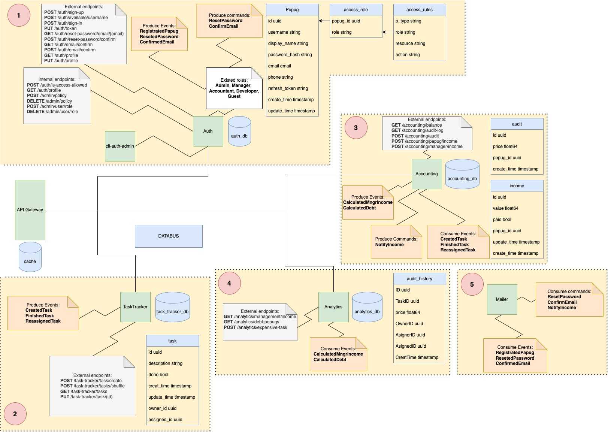
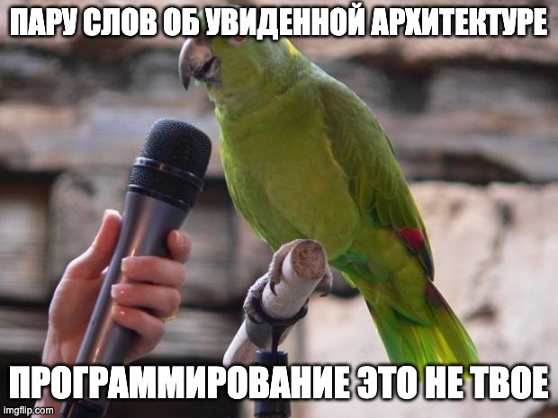

# Неделя №1. Проектрирование

## Содержание
1. [ Задание ](#task)
    - [ Контекст и проблема ](#task-context-and-problem)
2. [ Сведения ](#information)
3. [ Ход работы ](#work)
    - [ Область регистрации, аутентификации и авторизации ](#work-authorization-domain)
      - [ Микросервис **auth** ](#work-authorization-domain-auth-microservice)
        - [ HTTP-Handlers ](#work-authorization-domain-auth-microservice-http-handlers)
        - [ Events ](#work-authorization-domain-auth-microservice-events)
        - [ Commands ](#work-authorization-domain-auth-microservice-commands)
      - [ CLI-приложение **cli-auth-admin**](#work-authorization-domain-cli-auth-admin)
    - [ Область Таск-трэкинга ](#work-task-tracking-domain)
      - [ Микросервис **task_tracker** ](#work-task-tracking-domain-task-tracker-microservice)
        - [ HTTP-Handlers ](#work-task-tracking-domain-task-tracker-microservice-http-handlers)
        - [ Events ](#work-task-tracking-domain-task-tracker-microservice-events)
    - [ Область Аккаунтинга ](#work-accounting-domain)
      - [ Микросервис **accounting** ](#work-accounting-domain-accounting-microservice)
        - [ HTTP-Handlers ](#work-accounting-domain-accounting-microservice-http-handlers)
        - [ Events ](#work-accounting-domain-accounting-microservice-events)
        - [ Commands ](#work-accounting-domain-accounting-microservice-commands)
    - [ Область Анатилики ](#work-analytics-domain)
      - [ Микросервис **analytics** ](#work-analytics-domain-analytics-microservice)
        - [ HTTP-Handlers ](#work-analytics-domain-analytics-microservice-http-handlers)
        - [ Events ](#work-analytics-domain-analytics-microservice-events)
    - [ Область Нотификации ](#work-notification-domain)
      - [ Микросервис **mailer** ](#work-authorization-domain-mailer-microservice)
        - [ Events ](#work-authorization-domain-mailer-microservice-events)
        - [ Commands ](#work-authorization-domain-mailer-microservice-commands)
4. [ Итоги ](#results)

## Задание
Спроектировать крупными мазками мастера (обязательно попужьями) Awesome Task Exchange System (aTES) для UberPopug Inc.

### Контекст и проблема
Топ-менеджмент UberPopug Inc столкнулся с проблемой производительности сотрудников. Чтобы повысить производительность, 
было принято решение выкинуть текущий таск-трекер и написать особый Awesome Task Exchange System (aTES), который должен 
будет увеличить производительность сотрудников на неопределённый процент. Чтобы попуги развивались и изучали новые 
направления, была придумана инновационная схема ассайна каждой задачи на случайного сотрудника. А для повышения 
мотивации топ-менеджмент решил сделать корпоративный аккаунтинг в таск-трекере, чтобы по количеству выполненных задач 
выплачивать сотрудникам зарплату. При этом задачи оцениваются с плавающим коэффициентом (местами отрицательным).

## Сведения
В ходе проектирования:
- понадобился [draw.io](https://drawio-app.com/);
- ни один папуг не пострадал;
- все права на Awesome Task Exchange System принадлежат UberPopug Inc;
- один из наших преданных пользователей поделился user-experience'ом после увиденной черновой версии Awesome Task Exchange System:

## Ход работы
В ходе многочисленных папужьих баталий была рождена следующая схема:

Из рисунка видно, что было выделено 4 доменных областей.

### Область регистрации, аутентификации и авторизации
Область регистрации, аутентификации и авторизации на представленной схеме выделана **цифрой 1**.

С этой областью папуги быстро разобрались. Компетенция этой области заключается в:
- регистрации папуг;
- проверке прав пользователя. Чтоб неуполномоченная папуга не смогла, например, делать то, что предназачено админским и 
 менеджерским папугам;
- админские ручки;
- и все манипуляции над профелем папуг.

Данная доменная область представлена:
- микросервисом **auth**;
- базой данных **auth_db**;
- CLI-приложением для админов **cli-auth-admin**.

#### Микросервис **auth**
Микросервис представляет собой http-сервер, возможно grpc-сервер (папуги еще точно не решили).

##### Http-handlers
В своем распоряжении он имеет следующие http-handler'ы:
- Внешние http-handler'ы (видны из api-gateway'я): 
  - **/auth/sign-up** - регистрация папуги;
  - **/auth/available/username** - проверка доступности уникольного имени папуги;
  - **/auth/sign-in** - аутентификация папуги с дальнейшим получением токена;
  - **/auth/token** - обновление refresh-token'а папуги;
  - **/auth/reset-password/email/{email}** - запрос на сброс пароля по email'у папуги;
  - **/auth/reset-password/confirm** - сброс пароля по высланому коду;
  - **/auth/email/confirm** - запрос на подтверждение email'а папуги;
  - **/auth/email/confirm** - подтверждение email'а  папуги;
  - **/auth/profile** - получение профиля папуги;
  - **/auth/profile** - обновление профиля папуги;
- Внутренние http-handler'ы (не видны из api-gateway'я):
  - **/auth/is-access-allowed** - проверка прав доступа папуга к запрашиваемому ресурсу по определнному действию. Под ресурсом 
мы понимаем наименование url-а, по которому стучится попуга, а под действием сам метод endpoint'а (GET, POST, PUT и тд);
  - **/admin/policy POST** - создание новой роли и действий, которые может осущствлять роль. Например роль guest, может только
регистрироваться и аутентифицироваться;
  - **/admin/policy DELETE** - удаление существующей роли, с прикрепленным к ней дествиями.
  - **/admin/user/role POST** - наделение заданного папуга ролью;
  - **/admin/user/role DELETE** - изымание заданной роли у папуга.

##### Events
В своем жизненном цикле микросервис **auth** генерирует три события:
- Папуг зарегистрировался (**RegistratedPapug**). Необходимо данное событие, для того чтобы поздравить счастливчика 
email-сообщением об этом (Сделает это отдельный микросервис **mailer** - о нем чуть позже). Возможно когда-то кому-то 
понадобится ввести стастистику, для этого потребуется быть конъюмером этого события;
- Папуг изменил пароль (**ResetedPassword**). Необходимо для уведомления папуги об успешном изменении пароля по всему 
тому же email-у. Отправит email-сообщение микросервис **mailer**;
- Папуг подтвердил email (**ConfirmedEmail**). Необходимо для уведомления папуги об успешном подтверждении email'а. 
Отправит email-сообщение микросервис **mailer**;

##### Commands
В своем жизненном цикле микросервис **auth** генерирует две команды:
- Папуг хочет изменить пароль (**ResetPassword**). Необходима данная команда для того, чтобы папуге выслали код
подтверждения на email, по которому он сможет изменить пароль в дальнейшем. Отправит email-сообщение микросервис 
**mailer**;
- Папуг хочет подтвердить email (**ConfirmEmail**). Необходима данная команда для того, чтобы папуге выслали код
подтверждения на email, по которому он сможет подтвердить свой email-адрес. Отправит email-сообщение микросервис
**mailer**;

#### CLI-приложение **cli-auth-admin**
CLI-приложение представляет собой админскую тулзу, использующую с умослом безопасности, чтоб ни одна недобросовестная 
папуга не смогла воспользоваться админскими ручками. Обычно такие тулзы лежат рядышком с микросервисом и доступ есть 
только у админов.

CLI-приложение вызывает следующие внутренние ednpoint'ы микросервиса **auth**:
- **/admin/policy POST**
- **/admin/policy DELETE**
- **/admin/user/role POST**
- **/admin/user/role DELETE**

Подробное их описание можно найти выше.

### Область Таск-трэкинга
Область Таск-трэкинга на представленной схеме выделана **цифрой 2**. Отвечает за создание, назначение, выполенение 
и менеджмент задач, которые крутятся вокруг папуг.

Данная доменная область представлена:
- микросервисом **task_tracker**;
- базой данных **task_tracker_db**.

#### Микросервис task_tracker
Микросервис представляет собой http-сервер, возможно grpc-сервер (папуги еще точно не решили).

##### Http-handlers
В своем распоряжении он имеет следующие http-handler'ы:
- Внешние http-handler'ы (видны из api-gateway'я):
  - **/task-tracker/task/create** - создание задачи;
  - **/task-tracker/tasks/shuffle** - рандомный заассайн открытых задач;
  - **/task-tracker/tasks** - просмотр своих задач;
  - **/task-tracker/task/{id}** - обновление статуса по задаче (пометить задачу выполненной).
  

##### Events
В своем жизненном цикле микросервис **task_tracker** генерирует три события:
- Задача создана (**CreatedTask**). Данное событие необходимо для ведения аудита, а именно: *сколько списать денег с 
сотрудника при ассайне задачи*;
- Задача завершена папугой (**FinishedTask**). Данное событие необходимо для ведения аудита, а именно: *сколько 
начислить денег сотруднику для выполненой задачи*;
- Задача перераспределена (**ReassignedTask**). Данное событие необходимо для ведения аудита, а именно: *сколько списать денег с
  сотрудника при ассайне задачи*.

### Область Аккаунтинга
Область Аккаунтинга на представленной схеме выделана **цифрой 3**. Отвечает за весь аудит, который крутится вокруг 
пупужьих задач.

Данная доменная область представлена:
- микросервисом **accounting**;
- базой данных **accounting_db**.

#### Микросервис accounting
Микросервис представляет собой http-сервер, возможно grpc-сервер (папуги еще точно не решили).

##### HTTP-Handlers
В своем распоряжении он имеет следующие http-handler'ы:
- Внешние http-handler'ы (видны из api-gateway'я):
    - **/accounting/balance** - текущий баланс папуги;
    - **/accounting/audit-log** - весь подробный лог асайнов и завершения задач с прибылью и убылью для папуги;
    - **/accounting/audit** - доступ к общей статистике по деньгами заработанным (количество заработанных 
    - топ-менеджментом за сегодня денег + статистика по дням);
    - **/accounting/papug/income** - количество заработанных папугой денег за временной интервал;
    - **/accounting/manager/income** - количество заработанных менеджером денег за временной интервал.

##### Events
В своем жизненном цикле микросервис **accounting** потребляет три события:
- Задача создана (**CreatedTask**). Данное событие необходимо для ведения аудита, а именно: *сколько списать денег с
  сотрудника при ассайне задачи*;
- Задача завершена папугой (**FinishedTask**). Данное событие необходимо для ведения аудита, а именно: *сколько
  начислить денег сотруднику для выполненой задачи*;
- Задача перераспределена (**ReassignedTask**). Данное событие необходимо для ведения аудита, а именно: *сколько списать
денег с сотрудника при ассайне задачи*.

А также в своем жизненном цикле микросервис **accounting** генерирует два события:
- Расчитанный доход менеджера (**CalculatedMngrIncome**). Данное событие необходимо для ведения аналитики о заработке 
менеджерского персонала;
- Вычисленный должник (**CalculatedDebt**).  Данное событие необходимо для ведения аналитики о должниках или о попугах,
ушедших в минус.

##### Commands
В своем жизненном цикле микросервис **accounting** генерирует одну команду:
- Поставь в известность о доходе (**NotifyIncome**). Так так в конце дня необходимо:
  - считать сколько денег сотрудник получил за рабочий день;
  - отправлять на почту сумму выплаты.

Отправит на почту сумму выплаты микросервис **mailer**.

### Область Анатилики
Область Анатилики на представленной схеме выделана **цифрой 4**. Анализирует:
- cколько заработал топ-менеджмент за сегодня;
- cколько попугов ушло в минус;
- самая дорогая задача за интервал времени.

Данная доменная область представлена:
- микросервисом **analytics**;
- базой данных **analytics_db**.

#### Микросервис analytics
Микросервис представляет собой http-сервер, возможно grpc-сервер (папуги еще точно не решили).

##### HTTP-Handlers
В своем распоряжении он имеет следующие http-handler'ы:
- Внешние http-handler'ы (видны из api-gateway'я):
    - **/analytics/management/income** - сколько заработал топ-менеджмент за сегодня;
    - **/analytics/debt-popugs** - сколько попугов ушло в минус;
    - **/analytics/expensive-task** - показывать самую дорогую задачу за день, неделю или месяц.

##### Events
В своем жизненном цикле микросервис **analytics** потребляет два события:
- Расчитанный доход менеджера (**CalculatedMngrIncome**). Данное событие необходимо для ведения аналитики о заработке
  менеджерского персонала;
- Вычисленный должник (**CalculatedDebt**).  Данное событие необходимо для ведения аналитики о должниках или о попугах,
  ушедших в минус.

### Область Нотификации
Область Нотификации на представленной схеме выделана **цифрой 5**. Предназначена для отправки нотификации пользователю.

Данная доменная область представлена:
- микросервисом **mailer**.

#### Микросервис mailer
Микросервис представляет собой http-сервер, возможно grpc-сервер (папуги еще точно не решили).

##### Events
В своем жизненном цикле микросервис **mailer** потребляет три события:
- Папуг зарегистрировался (**RegistratedPapug**). Необходимо данное событие, для того чтобы поздравить счастливчика
  email-сообщением об этом;
- Папуг изменил пароль (**ResetedPassword**). Необходимо для уведомления папуги об успешном изменении пароля по всему
  тому же email-у;
- Папуг подтвердил email (**ConfirmedEmail**). Необходимо для уведомления папуги об успешном подтверждении email'а;

##### Commands
В своем жизненном цикле микросервис **mailer** потребляет три команды:
- Папуг хочет изменить пароль (**ResetPassword**). Необходима данная команда для того, чтобы папуге выслали код
  подтверждения на email, по которому он сможет изменить пароль в дальнейшем;
- Папуг хочет подтвердить email (**ConfirmEmail**). Необходима данная команда для того, чтобы папуге выслали код
  подтверждения на email, по которому он сможет подтвердить свой email-адрес;
- Поставь в известность о доходе (**NotifyIncome**). Так так в конце дня необходимо:
    - считать сколько денег сотрудник получил за рабочий день;
    - отправлять на почту сумму выплаты.

## Итоги
В ходе выполнения задания:
- титаническими усилиями папуг было соверешено проектирование **Awesome Task Exchange System** ;
- предложенная схема была декомпозирована на четыре доменных областей:
  - область регистрации, аутентификации и авторизации;
  - область Таск-трэкинга;
  - область Аккаунтинга;
  - область Анатилики;
  - область Нотификации.
- каждая из областей была представлена совокупностью микросервисов и баз данных.
- были перечислены задествованные в микросервисе:
  - http-handler'ы;
  - event'ы;
  - сommand'ы.

Так же был приглашен эксперт на ревью предложенного решения. Комментарий которого можно увидеть ниже

